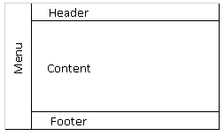

# Bootcamp DIO - NTT DATA Diversidade em Tech
## Módulo 1 - Primeiros passos com HTML

## Entendo o Desafio
 
Este desafio tem como objetivo, criar um site "quase" completo, com tudo o que vimos neste módulo. Os temas que deverão ser abordados são:
* Formulários
* Estruturação e formatação de texto
* Mídias
* Tabelas

Além de outros recursos falados nas aulas!
 
## Instruções
1. Você deve criar um site de uma clínica médica (você escolhe a especialidade)
2. Este site deve conter o seguinte menu de navegação:
    * Página Principal
    * Sobre a clínica
    * Horário de Atendimento
    * Contato
3. Deve, obrigatoriamente, utilizar todas os assuntos abordados nas aulas.

Abaixo como cada página deve ser criada e estruturada.

## Estrutura das Páginas
Todas as páginas terão que seguir um padrão pré-definido. Como não aprendemos sobre CSS ainda, utilize o arquivo template.html para utilizar como base. Ele segue uma estrutura semelhante a image abaixo.

<i> \* No template tem algumas cores mas é apenas para melhor visualização. Fique a vontade para alterar da melhor forma.</i>

No <b>Menu</b>, ficará localizado o menu de navegação (ah vá!), no <b>Header</b> de cada página ficará uma imagem, no <b>Footer</b> informações de contato, e o <b>Content</b> é o conteúdo de cada página.

## Página Principal
1.  Deve ter uma imagem no <b>Header</b>.
2.  Em <b>Content</b> uma breve descrição sobre a clínica.
3.  <b>Menu</b> e <b>Footer</b> padrões em todas as páginas.

## Sobre a clínica
1. Deve ter uma imagem diferente no <b>Header</b>.
2. Em <b>Content</b> um texto falando sobre a clínica.
3. <b>Menu</b> e <b>Footer</b> padrões em todas as páginas.

## Horário de Atendimento
1. Deve ter uma imagem diferente no <b>Header</b>.
2. Em <b>Content</b> um pequeno texto falando sobre os serviços, e uma tabela de preços, onde cada linha é um serviço, com o preço de cada um de acordo com os dias da semana.
3. <b>Menu</b> e <b>Footer</b> padrões em todas as páginas.

Serviços|Segunda a Sexta|Sábados|Feriados   
:--------------: | :------------------: | :---------: | :-----------:
Clínica geral |08h - 19h |08h - 14h | 08h - 14h  
Psicologia |08h - 19h |08h - 14h |08h - 14h  
Pediatria |08h - 19h |08h - 18h | -      
Oftalmologia |08h - 19h |08h - 18h | -      

## Contato
1. Deve ter uma imagem diferente no <b>Header</b>.
2. Em Content deve ter:
    * Os telefones de contato (celular e whatsapp)
    * Endereço completo da clínica
    * Um Iframe com o Google Maps apontando o endereço da clínica
    * Um formulário de contato com:
        * Nome (type="text")
        * E-mail (type="email")
        * Assunto (type="text")
        * Mensagem (textarea)
        * Botões de envias e limpar formulário
3. <b>Menu</b> e <b>Footer</b> padrões em todas as páginas.
Desafio está lançado! Com tudo que aprendemos neste Módulo é perfeitamente possível criar este site!
 
# GitHub
O código-fonte base preparado para este Desafio de Projeto está versionado no GitHub, no seguinte endereço:
<https://github.com/digitalinnovationone/trilha-html-modulo-2>
 
Bons estudos
:smiley: